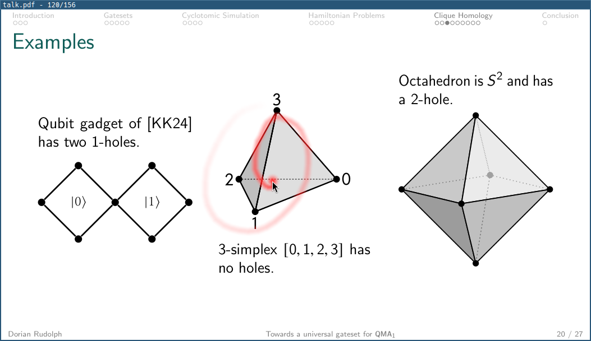

# pdfstage

No-frills presentation tool for PDFs.



## Features

- Laser pointer with tail, right-drag highlight, and middle-click magnifier.
- Optional mirror window for screensharing without window decorations.
- Hot reload for regenerated PDFs.
- Zoom into slides.

## Usage

Tested on Linux and Mac.

```sh
cargo install --git https://github.com/dorianrudolph/pdfstage --locked
```

```sh
pdfstage talk.pdf
```

Options:

```sh
pdfstage [OPTIONS] <PDF>

-m, --mirror             Open a second mirror window
-r, --hot-reload         Reload when the PDF file changes
-f, --free-aspect        Allow windows to resize without preserving slide aspect
-c, --cache-mib <MiB>    Per-window GPU page cache budget [default: 1024]
-a, --ahead <N>          Pages to render ahead [default: 3]
```

## Controls

- `Right`, `PageDown`, `Enter`, `Space`, mouse forward, `Shift` + scroll down: next slide
- `Left`, `PageUp`, `Backspace`, mouse back, `Shift` + scroll up: previous slide
- `Home` / `End`: first / last slide
- `0`: reset zoom
- `f` or `F11`: toggle fullscreen
- `d`: toggle window decorations
- `r`: reload PDF
- `Esc`: exit fullscreen
- `Ctrl` + `Q`: quit
- Mouse wheel: zoom in / out
- Touchpad pinch: zoom in / out
- Two-finger pan or middle mouse drag while zoomed: pan
- Left mouse hold: laser pointer
- Right mouse drag: highlight
- Middle mouse hold while not zoomed: magnifier
- `Ctrl` + left drag: move window
- `Ctrl` + right drag: resize window

## License

[AGPL-3.0](LICENSE)

## Credits

Built with:

- [MuPDF](https://mupdf.com/) via [mupdf-rs](https://github.com/messense/mupdf-rs) for PDF rendering
- [wgpu](https://wgpu.rs/) for GPU rendering
- [winit](https://github.com/rust-windowing/winit) for windows and input
- [clap](https://github.com/clap-rs/clap) for command-line parsing
